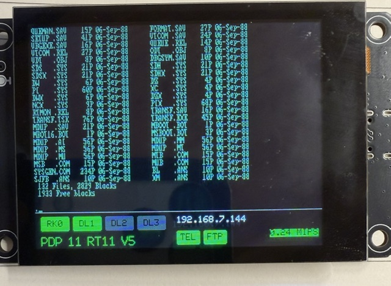

# vpdp1170 — a DEC PDP-11/70 emulator for the ESP32-S3 with a touch screen display.

> Development status: this project has been scaffolded from `vpdp1140`.
> The ESP32 host side is present now: TFT console, touch menu, Telnet, FTP,
> SD card configuration, monitor/shell, and disk image management. The actual
> PDP-11/70 CPU/MMU/device replacement is not wired in yet. The current build
> still contains the inherited `vpdp1140` 11/40-derived core as a baseline
> while the `kek` PDP-11/70 engine is being evaluated and imported.

A **Freenove ESP32-S3 2.8" Display** board turned into a tiny DEC
PDP-11/70 that boots **V6 Unix** from an SD-card disk image. The console
appears on the onboard TFT, on Telnet, and on USB-Serial — all three live
simultaneously. Also boots RT-11 V5, RSTS V4B, RSX-11M V4.0, RSX-11M V4.8
124KW, and XXDP.

For full operating instructions, SD card setup, configuration-file reference,
and menu documentation, see the [PDP 11/70 Emulator User Guide](docs/user-manual.md).
For the 11/70 engine replacement plan and device source decisions, see
[vpdp1170 Device Source Plan](docs/device-plan.md).



```
            +------------------------------+
            |  RT-11SJ V05.07              |
            |                              |
            |  .DIR                        |
            |  RT11 .SYS    79 12-Jun-77  ... |
            |  ...                         |
            +------------------------------+
                 ESP32-S3 / ILI9341 TFT
                 + Telnet + USB-Serial
```

The current baseline CPU core is inherited from `vpdp1140` and is kept only
as a working scaffold. The target CPU/MMU/device engine is
[**kek**](https://github.com/folkertvanheusden/kek), an MIT-licensed
PDP-11/70 emulator with ESP32 support. The host scaffolding (TFT console,
Telnet server, FTP server, dual-core split, SD-backed block I/O,
`/wificonfig.ini` + `/pdpconfig.ini`, capacitive-touch settings menu,
WS2812 status LED) is inherited from `vpdp1140` and remains the board-facing
side of this project.

## Current Scaffold Status

The active Arduino sketch now reports its CPU engine at boot and on the
System Info screen. At this stage it should say `sam11 PDP-11/40 scaffold`.
The desktop Visual Studio/CMake harness under `tools/kek_vs_core` proves a
stripped `kek` CPU path can be built and stepped separately, but the Arduino
sketch is not yet running the `kek` PDP-11/70 engine. The future selection
switch is `VPDP1170_USE_KEK_CORE` in `config.h`; the internal compile gate is
`VPDP1170_BUILD_KEK_ADAPTER`. Early Arduino adapter staging lives under
`kek_port/` and remains gated until the kek include shims and source selection
are ready.

| Guest OS              | Disk image          | Result                            |
|-----------------------|---------------------|-----------------------------------|
| **V6 Unix**           | `unixv6.dsk` (RK05) | ✅ Boots to `@`, then `#` shell   |
| **XXDP+ diagnostics** | `xxdp25.dsk` (RL02) | ✅ Boots to XXDP-SM `.` monitor    |
| RT-11 SJ V5           | `rt11v5.dsk` (RK05) | ✅ Boots to . prompt, runs DIR   |
| RSTS V4B              | `RSTS11v4B.dsk`     |✅ Boots to READY prompt          |
| RSX-11M V4.0          | RL01/RL02 image      | ✅ Boots successfully            |
| RSX-11M V4.8          | RL01/RL02 image      | ✅ Boots 124KW mapped system     |

The table above reflects inherited `vpdp1140` behavior, not completed
PDP-11/70 validation. The `vpdp1170` bring-up target is to replace the
PDP-visible hardware with `kek` CPU/MMU/devices while preserving the ESP32
host services.

## Hardware

- **Freenove ESP32-S3  2.8" Display** board (FNK0104B): ILI9341
  TFT, FT6336U capacitive touch, micro-SD slot, 8 MB Octal PSRAM,
  16 MB flash.

## Emulated configuration

| Component       | What we emulate                                                   |
|-----------------|-------------------------------------------------------------------|
| CPU             | Target: PDP-11/70 via `kek`; current scaffold still uses inherited 11/40 core |
| Memory          | Target: 4 MB PSRAM-backed 22-bit physical memory                  |
| MMU             | Target: PDP-11/70 22-bit MMU with kernel/supervisor/user spaces   |
| Console         | KL11 UART at `0o177560` (vector 060), bridged to TFT+Telnet+USB    |
| RK05 disk       | RK11 controller at `0o177400` (vector 220), up to 4 drives        |
| RL01/02 disk    | RL11 controller at `0o174400` (vector 160), up to 4 drives        |
| RP04/05/06 disk | RH11 controller at `0o176700` (vector 254), RP0 as secondary disk; testing mode, not yet verified |
| Line clock      | KW11-L at `0o177546` (vector 100), tickrate ~60 Hz                |
| Programmable clock | KW11-P at `0o172540` (vector 104, BR6), four rates, repeat/one-shot |
| Boot ROM        | DEC M9312-style RK0 / RL0 stubs (selected by `boot=` in config)   |

The status bar below the 80×25 console shows drive activity, WiFi IP,
Telnet / FTP state and MIPS in real time.

## Building

Arduino IDE with the ESP32 board package and these libraries (same set
as v8088 — nothing PDP-11-specific):

- **TFT_eSPI** — with the `FNK0104B` setup enabled in `User_Setup_Select.h`
- **FT6336U** — Freenove-bundled touch library
- **Freenove_WS2812_Lib_for_ESP32**

The sam11 sources we use are copied directly into the sketch root (see
the file list below) so the Arduino IDE picks them up automatically. No
SdFat library is needed — we route all sam11 disk I/O through our own
`disk.cpp` block layer.

### Tools-menu settings (important)

| Setting            | Value                                |
|--------------------|--------------------------------------|
| Board              | **ESP32S3 Dev Module** (not "Octal") |
| USB CDC On Boot    | **Enabled**                          |
| PSRAM              | **OPI PSRAM**                        |
| Flash Size         | 16MB (128Mb)                         |
| Partition Scheme   | Huge App (3MB)                       |

Selecting an "…Octal" board variant, or PSRAM set to anything but OPI,
will bootloop the board.

## SD card layout

```
/wificonfig.ini      WiFi credentials (auto-created if missing)
/pdpconfig.ini       PDP-11 settings (auto-created if missing)
/wificonfig-*.ini    optional WiFi variants picked from the settings menu
/pdpconfig-*.ini     optional PDP variants picked from the settings menu
/unixv6.dsk          V6 Unix RK05 image  (2.5 MB)  ← validated boot
/xxdp25.dsk          XXDP+ diagnostics  (RL02, 10 MB)
/rt11v5.dsk          RT-11 SJ V5  (RK05, optional)
/rsts_full_rl.dsk    RSTS/E V7 boot pack  (RL01, optional)
/rsts_swap_rl.dsk    RSTS/E V7 swap pack  (RL01, optional)
```

Sample images for V6 / XXDP+ / RT-11 / BSD 2.9 / Caldera V5/V6 ship in
sam11's [`OS Images/`](https://gitlab.com/ChloeLunn/sam11/-/tree/master/OS%20Images)
directory.

## Config files

WiFi credentials live in `/wificonfig.ini`; everything else in
`/pdpconfig.ini`. Either file can be missing on first boot — the
firmware writes a default. Drop named copies onto the SD card
(`wificonfig-home.ini`, `pdpconfig-rt11.ini`, ...) and pick one from
the **WiFi Config** / **PDP Config** menu items; selection copies the
chosen variant over the active filename and you get a confirmation
screen offering to reset the ESP32 to apply it.

`/wificonfig.ini`:
```ini
[wifi]
ssid     = YourNetwork        ; blank uses secrets.h defaults
password = YourPassword
hostname = vpdp1170

[ftp]
enabled  = true               ; exposes the SD card root
port     = 21                 ; passive data uses port+1
user     = esp32
password = esp32
```

`/pdpconfig.ini`:
```ini
[telnet]
enabled = true
port    = 23

[console]
boot_input = ""               ; e.g. "unix\r" or "^CSTART\r"

[serial1]
enabled = false               ; TT1 file-backed DL11 at 0176500

[diag]
pcping      = 5               ; sec between PC dumps; 0 disables
serialdelay = 20              ; ms gate between bursty input chars
io_trace    = 0               ; trace next N I/O-page accesses
clock_trace = 0               ; trace next N clock accesses/IRQs
console_trace = 0             ; trace next N PDP console characters
trace       = false           ; true only for panic/HALT diagnosis
v4b_quirks  = true            ; RSTS V4B / RT-11 / V6 / XXDP
kwp_enabled = false           ; true for RSTS V7 bring-up

[disks]
; dl0..dl3 = RL01/RL02 packs (RL11 controller)
; rk0      = RK05 pack       (RK11 controller)
; rp0      = optional RP04/RP05/RP06 pack (RH11 controller)
; rp0_type = rp04, rp05, or rp06
; When boot=rk0 the rk0 image takes slot 0 in place of dl0.
dl0  = /xxdp25.dsk
dl1  =
dl2  =
dl3  =
rk0  = /unixv6.dsk
rp0  =
rp0_type = rp06
boot = rk0                    ; or dl0, dl1, dl2, dl3
```

### RL and RK disk selection

The emulator can boot from either controller:

- `boot = dl0` through `boot = dl3` selects the RL11 bootstrap and treats
  the four disk slots as RL drives `DL0` through `DL3`. RL mounts require
  exact RL01 images of 5,242,880 bytes or exact RL02 images of 10,485,760 bytes.
- `boot = rk0` selects the RK11 bootstrap. The `rk0` image is mounted in
  host slot 0 in place of `dl0`, so the guest sees it as RK drive `RK0`.
  RK05 images are approximately 2.5 MB; some distributions use paired or
  combined images of approximately 5 MB.

The current drive menu uses four shared host image slots. It does not assign
some slots permanently to RL11 and others to RK11, and it does not validate
an image's controller type. Mount RL images when using an RL boot and use the
configured `rk0` image when using an RK boot. Simultaneous mixed RL/RK drive
mapping is not currently supported.

### RP secondary disk

`rp0` mounts one optional RP-family image through an RH11/RP register set at
`0o176700`. Set `rp0_type` to `rp04`, `rp05`, or `rp06` so the controller
reports matching geometry. RP0 support is in testing mode and has not been
verified yet. RP0 is secondary storage only in this build; the boot menu and
M9312-style boot ROM still boot from RK0 or RL0.

## Using it

- The TFT console comes up at boot; the same byte stream is available
  via `telnet <board-ip> 23` and on USB serial (115200 baud).
- `/pdpconfig.ini` `[console] boot_input` can pre-load keystrokes after
  each PDP-11 boot/reset. It accepts escapes such as `\r`, `\n`, `\e`,
  `\x03`, `\033`, `^C`, `^[`, and `^?`.
- The SD card root is available over FTP at `ftp://<board-ip>:21/`
  using the `[ftp]` credentials in `/wificonfig.ini`.
- **Settings menu:** tap the screen or press the onboard button. From
  there you can mount/dismount existing disk images, reboot the PDP-11,
  adjust brightness, and view WiFi / Telnet / FTP status.

### Telnet management shell

While connected by Telnet, press `Esc`, then type `>>` to detach that Telnet
session from the PDP-11 console and enter the emulator management shell:

```text
ESC >>
```

The PDP-11 continues running and remains connected to the TFT and USB serial.
Type `exit` to reconnect Telnet to the PDP console. An incomplete escape
sequence is replayed to the PDP after five seconds.

The shell provides:

```text
pwd
cd <path>
ls [path]
cat <path>
rm <path>
mv <source> <destination>
cp <source> <destination>
drives
mount <RL0-RL3|RK0|RP0> <path> [ro]
dismount <RL0-RL3|RK0|RP0>
create <rk|rl01|rl02> <path>
set [name=value]
monitor
reboot
help
exit
```

File paths may be absolute or relative to the shell's current SD-card
directory. Quote paths containing spaces. Destructive file commands reject
mounted disk images, and `mount` requires the target drive to be dismounted
first. `cat` displays at most the first 100 lines and rejects binary files. The
guest operating system must flush and offline a drive before it is
dismounted. `create` makes zero-filled RK05 (2,494,464-byte), RL01
(5,242,880-byte), or RL02 (10,485,760-byte) images.
RL `mount` accepts only the two exact RL pack sizes: 5,242,880 bytes for RL01
or 10,485,760 bytes for RL02.

`set` with no arguments displays the runtime-changeable settings. Supported
assignments are `pcping`, `serialdelay`, `io_trace`, `clock_trace`,
`console_trace`, `trace`, `title`, and `boot_input`;
`boot_text` is accepted as an alias for `boot_input`. For example:

```text
set pcping=1
set io_trace=100
set clock_trace=100
set console_trace=100
set trace=false
set boot_input="hello\r"
```

These changes are not written to `/pdpconfig.ini` and are lost when the ESP32
restarts. `boot_input` takes effect on the next PDP-11 reboot.

The `monitor` command enters a front-panel-style PDP-11 monitor. Addresses and
values are octal:

```text
P                     pause after the current instruction
S                     execute one instruction and remain paused
C                     continue execution
D00100                dump 16 words from physical address 00100
D00100:00200          dump an inclusive physical address range
T 1000                trace the next 1000 instructions to USB serial
W000100=012345        deposit one word in physical RAM
>                     return to the management shell
```

`P` and `S` display the PC, R0-R5, SP, PSW, and the address, opcode, and
disassembly of the next instruction that `S` will execute. Memory dumps contain eight octal
words and their 16-byte printable ASCII
representation per line. Examine/deposit commands accept aligned physical RAM
addresses through `0757776`; the PDP-11 I/O page is deliberately excluded.
Each range dump is limited to 512 words. Leaving monitor mode does not
automatically resume a paused CPU; use `C` when execution should continue.
`T` takes a decimal instruction count; `T 0` cancels an active trace. Trace
lines are written to USB serial in the same register/opcode format as the
panic trace, with disassembly appended.

### Guest-to-emulator control channel

The VPDP command channel on TTY0 is always available. When `[serial1]
enabled = true`, TT1 is additionally exposed as a DL11-compatible serial port
at `0176500` using receive vector `0300` and transmit vector `0304`. A PDP
program can access SD-card files directly through commands regardless of the
TT1 setting; enabling TT1 also permits background file streaming through that
emulated serial port. Commands can also change active RK/RL media or reboot the
emulated PDP:

```text
ESC ] VPDP ; command-text ETX-or-EOT
```

In C, for example:

```c
printf("\033]VPDP;OUT;OPEN;/results.txt;APPEND;REPLY\003");
```

RSTS/E BASIC-PLUS displays `CHR$(27)` as `$` on its console. The emulator
therefore also accepts `$]VPDP;` as a compatibility prefix. For example:

```text
PRINT CHR$(27);"]VPDP;OUT;OPEN;/TEST1.DAT";CHR$(3)
```

The tested BASIC-PLUS form above opens `/TEST1.DAT` in append mode. Add
`;REPLY` before `CHR$(3)` to return a framed acknowledgement to the PDP
program.

The complete frame is intercepted and is not shown on the TFT, USB serial, or
Telnet. Command text is limited to 256 bytes. Printable characters plus CR,
LF, BEL, and TAB are accepted. ETX (`\003`) or EOT (`\004`) executes it; any
other non-printable character aborts it. Formatting controls are removed from
path arguments but remain unchanged in `OUTASCII` data.
Commands requesting `REPLY` receive an ETX-terminated frame in the KL11 input
queue using the same format.

Common commands:

```text
IN;OPEN;/commands.txt;EOF=0x04;NOTIFY;REPLY
IN;CLOSE;REPLY
OUT;OPEN;/results.txt;APPEND;REPLY
OUT;CLOSE;REPLY
TTY;STATUS;REPLY
OUTASCII;data written exactly, including CR/LF/BEL/TAB
OUTHEX;0001027F80FF
INASCII
INHEX:32
DISK;MOUNT;RL1;/new.dsk;REPLY
DISK;DISMOUNT;RL1;REPLY
DISK;STATUS;ALL;REPLY
PDP;REBOOT;COLD;REPLY
```

The direct `OUTASCII` and `OUTHEX` commands write to the currently connected
TT1 output file and flush it before returning. `OUTHEX` converts hexadecimal
pairs to binary bytes and permits spaces between pairs. Prefix the payload
with `REPLY;` to request an acknowledgement.

`INASCII` returns the next input-file line over TTY0, followed by a carriage
return.
`INHEX:n` reads up to `n` bytes (`1` through `128`) and returns uppercase
hexadecimal followed by a carriage return. If fewer than `n` bytes remain,
the response contains those bytes; the following read returns `*>EOF<*`.
Every input response, including `*>EOF<*` and errors, is terminated by a
carriage return.
Direct reads share the TT1 input position; do not have a TT1 driver consume
the same stream concurrently.

Runtime disk changes do not rewrite `pdpconfig.ini`. Before dismounting, the
guest OS must flush and offline/dismount the device using its OS-specific
command. RP0 runtime commands are not supported by this interface.

### Booting V6 Unix

1. Set `boot = rk0` and `rk0 = /unixv6.dsk` in `/pdpconfig.ini`.
2. Power the board. After the WiFi line you should see:
   ```
   vpdp1170: booting PDP-11/70 from RK0...
   @
   ```
3. Type `unix` and Enter — the V6 kernel loads and drops you at `#`.
4. Try `ls /`, `date`, `cat /etc/passwd`, even `cc hello.c`. The
   PDP-11 C compiler is on the disk.

### Booting XXDP+

1. Set `boot = dl0` and `dl0 = /xxdp25.dsk`.
2. After reset you'll see the XXDP-SM monitor prompt `.`. Try
   `R FKAAC0` for the basic instruction-set diagnostic.

## Inherited vpdp1140 Core Still Present

| File                          | Role                                                |
|-------------------------------|-----------------------------------------------------|
| `kd11.cpp` / `.h`             | Inherited PDP-11/40-derived CPU scaffold            |
| `kt11.cpp` / `.h`             | Inherited 18-bit MMU scaffold                       |
| `ms11.cpp` / `.h`             | RAM controller — routed to our PSRAM block          |
| `dd11.cpp` / `.h`             | UNIBUS backplane, I/O page dispatch                 |
| `kl11.cpp` / `.h`             | KL11 console — rewired to TFT+Telnet+USB           |
| `telnet_shell.cpp` / `.h`     | Telnet management shell and SD-card commands        |
| `rk11.cpp` / `.h`             | RK11 controller — rewired to `disk.cpp`             |
| `rl11.cpp` / `.h`             | RL11 controller (fresh implementation; not sam11's) |
| `rh11.cpp` / `.h`             | RH11/RP04-RP06 secondary disk controller            |
| `kw11.cpp` / `.h`             | KW11-L line clock                                   |
| `cpu/cpu_*.cpp.h`             | Instruction implementations                         |
| `pdp1140.h`                   | Legacy device addresses, trap vectors, build flags  |
| `bootrom.h`                   | M9312-style RK0 / RL0 boot ROMs                     |
| `sam11_platform.h`            | Our ESP32-S3 platform shim (replaces sam11's)       |

This section describes the inherited baseline only. The `vpdp1170` target is
to replace PDP-visible CPU/MMU/bus/device behavior with `kek` while retaining
the ESP32 host services.

The aggregated sam11 source originally vendored in `_upstream_sam11/`
was copied to the sketch root and edited for `vpdp1140`.
The most material changes are:

- **14 instruction-correctness fixes** in `cpu/cpu_instr.cpp.h` (INC, ROR,
  SWAB, ADD, SUB, NEG, ADC, SBC, ASR, MUL, SXT, MARK, CCC, SBC) — found
  by running XXDP+ FKAAC0.
- **3 new instructions** added (SPL, MTPS, MFPS) — needed for XXDP's
  FKABD0 trap test.
- **PSRAM-backed `ms11`** — sam11's stock allocator wanted a 248 KiB
  array in DRAM, which is most of the ESP32's RAM.
- **Custom `rl11.cpp`** — sam11's stock RL11 is WIP and didn't drive
  XXDP+; rewrote from scratch using the same DEC RL11 manual.
- **Deferred RK11 done-IRQ** in `rk11.cpp` — sam11's stock fires the IRQ
  synchronously inside the controller-register write, which beats the
  guest's `MOV cmd,RKCS / WAIT` pattern and hangs RT-11. We delay by
  ~256 host steps so the WAIT runs first.

## Milestones

- ✅ **m0** Fork v8088, rename / strip down, sketch compiles
- ✅ **m1** Vendor sam11, in-sketch CPU self-test passes
- ✅ **m2** KL11 console on TFT + Telnet + USB-Serial
- ✅ **m3** RL11 → XXDP+ boots; 14 sam11 CPU bugs fixed; SPL/MTPS/MFPS added
- ✅ **m4** V6 Unix boots from RK05 to `#` prompt
- ⏸ **m5** — m4's V6 boot is what m5 was supposed to add (XXDP); already done in m3
- **Settings menu:** mount or dismount existing images on DL0..DL3 and RK0.
- ⏳ **m7** KW11-L line clock — present, but tickrate could be calibrated
- ⏳ **m8** Second DL11 tunneling SD file I/O — designed in chat, not yet built
- ⏳ **m9** RT-11 / RSTS chase — sam11 known-broken; deep-dive if motivated
- ✅ **m10** README polish + GitHub push  ← **this commit**

## Credits

- CPU core: **sam11** by Chloe Lunn — BSD-3-Clause —
  https://gitlab.com/ChloeLunn/sam11
- sam11 descends from Julius Schmidt's JavaScript PDP-11 emulator and
  Dave Cheney's [avr11](https://dave.cheney.net/2014/01/23/avr11-simulating-minicomputers-on-microcontrollers).
- Host scaffolding: ESP32-S3 TFT/Telnet/SD/dual-core stack forked from
  [v8088](https://github.com/deangi/vMSDOS), which itself ports Adrian
  Cable's [8086tiny](https://github.com/adriancable/8086tiny).
- 4×8 console font: public-domain IBM VGA font (via dhepper/font8x8).
- Sample disk images: sam11's `OS Images/` and
  https://www.pcjs.org/software/dec/pdp11/disks/rl02k/xxdp/

## License

vpdp1170 itself is provided under the same license as the upstream
sam11 code it builds on: **BSD 3-Clause**. See `LICENSE` for the full
text. The vendored sam11 sources retain their original copyright notice
(Copyright 2021 Chloe Lunn).
