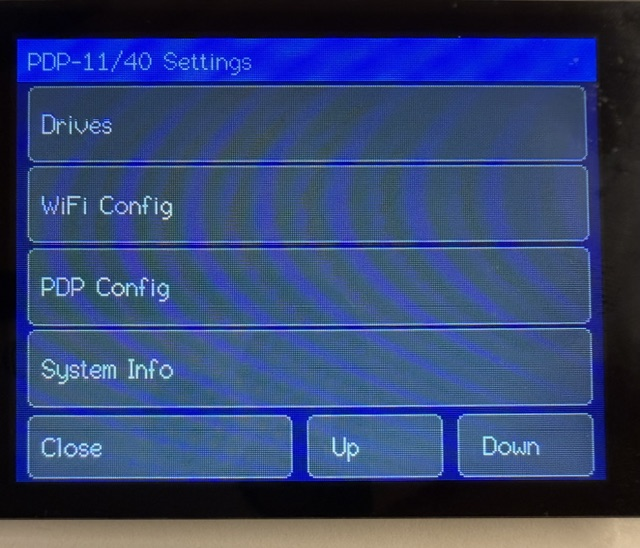
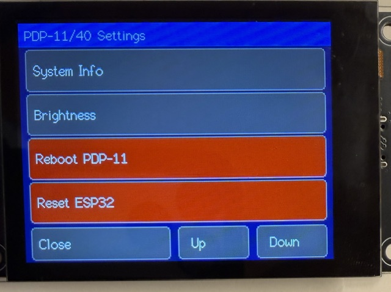
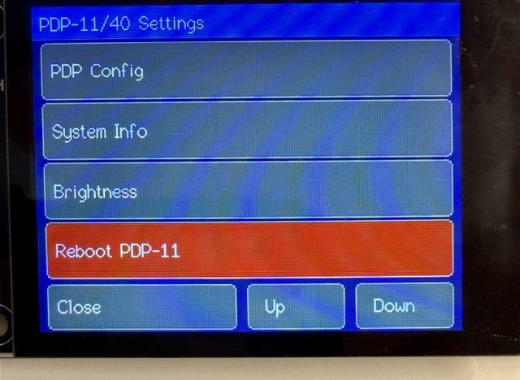
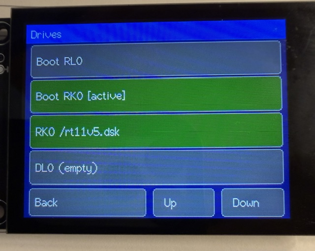
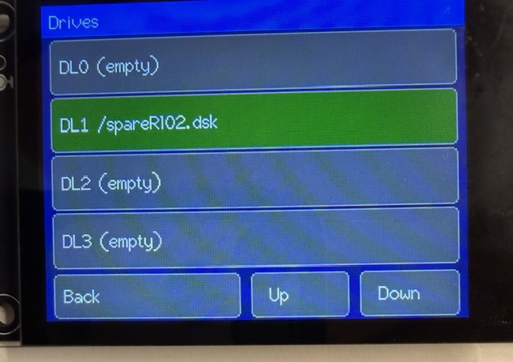
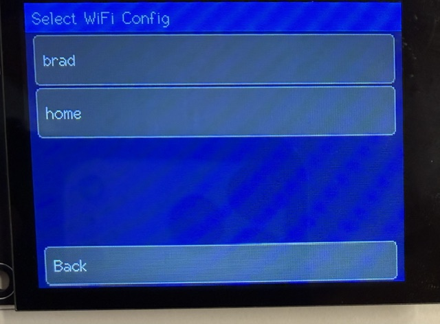
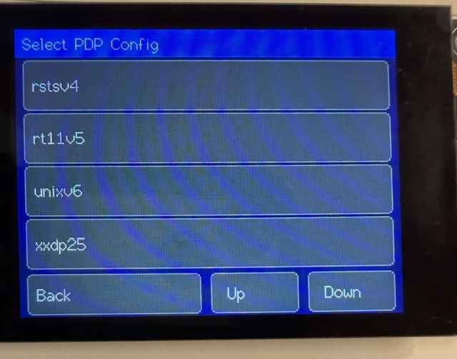
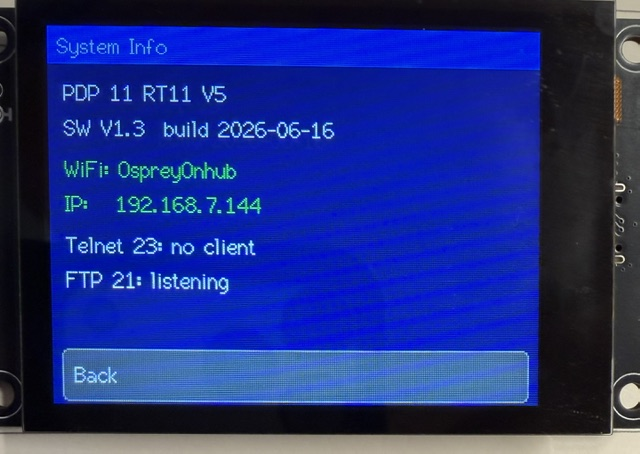

# PDP 11/70 Emulator User Guide

This guide covers the `vpdp1170` emulator for the Freenove ESP32-S3 2.8"
Display board. It describes the emulated PDP-11/70 system, SD card files,
network services, configuration files, and on-device menus.

## Overview

`vpdp1170` emulates a Digital Equipment Corporation PDP-11/70 on an ESP32-S3
board with a TFT display, capacitive touch, microSD storage, WiFi, Telnet, and
FTP.

The emulator can boot and run several PDP-11 operating systems from disk image
files stored on the SD card. The PDP-11 console is available on the TFT screen,
USB serial, and Telnet at the same time.

The emulator also provides an optional second serial port, TT1, and a private
guest-to-emulator command channel. A PDP program can use this channel to:

- Connect or disconnect SD-card files as TT1 input and output streams.
- Transfer text lines or hex-encoded binary data directly over TTY0 without
  requiring a guest TT1 device driver.
- Select an EOF byte and request an EOF notification.
- Receive optional command status replies through the TTY0 KL11 input queue.
- Mount, dismount, and query active RL or RK disk images without restarting
  the ESP32.
- Cold-reboot the emulated PDP-11 without restarting WiFi, FTP, or Telnet.

These runtime-control capabilities are new and require testing with each guest
operating system. In particular, the guest must flush and offline/dismount a
disk before asking the emulator to detach its image.


## Emulated Hardware

| Component | Emulation |
| --- | --- |
| CPU | PDP-11/70 core through the kek adapter |
| Memory | 4 MB target physical memory backed by ESP32-S3 PSRAM |
| MMU | PDP-11/70 22-bit memory-management path, under active bring-up |
| Console | KL11 console at `0177560`, vector `060` |
| Alternate serial | Optional file-backed DL11-compatible TT1 at `0176500`, receive vector `0300`, transmit vector `0304` |
| RK disk | RK11 controller for RK05 images |
| RL disk | RL11 controller, up to two normal RL drives in common configurations, with four host slots available as `DL0`..`DL3` |
| RP disk | Optional secondary RH11/RP04-RP06 disk as `RP0`; testing mode, not verified yet, and not currently bootable |
| Clocks | KW11-L line clock and optional KW11-P programmable clock |
| Boot ROM | M9312-style boot stubs for RK0 and RL0 |

The V1.1 bring-up path allocates the PDP-11/70 4 MB physical memory target in
PSRAM. The inherited 11/40-derived CPU/MMU scaffold remains in the source tree
for reference while the kek device set is ported.

## Supported Operating Systems

These systems boot with this release:

| System | Typical media | Status |
| --- | --- | --- |
| RT-11 V5.04 | RK05 | Boots to the `.` prompt and runs `DIR` |
| RSTS V4B | RK05 | Boots to the `READY` prompt |
| UNIX V6 | RK05 | Boots from `@` to the `#` shell |
| XXDP V2.2 | RL02 | Boots the XXDP monitor |
| XXDP V2.5 | RL02 | Boots the XXDP monitor |
| RSX-11M V4.0 | RL01/RL02 | Boots successfully |
| RSX-11M V4.8 | RL01/RL02 | Boots 124KW mapped system |

Other PDP-11 operating systems may probe hardware that is incomplete,
configured differently, or intentionally disabled for compatibility. RSTS/E V7
and larger UNIX systems are useful bring-up targets, but may need different
compatibility settings and more complete MMU/device behavior.

## SD Card

Use a microSD card of up to 32 GB. The firmware stores configuration files and
PDP-11 disk images in the SD card root.

Typical root layout:

```text
/wificonfig.ini
/pdpconfig.ini
/wificonfig-home.ini
/pdpconfig-rt11.ini
/unixv6.dsk
/rt11v5.dsk
/rsts4b.dsk
/xxdp25.dsk
```

Disk images may use extensions such as `.dsk`, `.hdd`, `.img`, or `.ima`.
The on-device drive picker scans the SD root for those extensions.

## Configuration Files

The emulator uses two main initialization files:

| File | Purpose |
| --- | --- |
| `/wificonfig.ini` | WiFi credentials plus Telnet and FTP settings |
| `/pdpconfig.ini` | PDP-11 emulator title, boot input, diagnostics, compatibility, and disk image settings |

If either file is missing, the firmware writes a default file to the SD card.

Lines beginning with `;` or `#` are comments. Inline comments after values are
also accepted unless the comment character is inside quotes.

### Config Variants

You can keep multiple named configuration variants on the SD card:

```text
/wificonfig-home.ini
/wificonfig-shop.ini
/pdpconfig-rsts4b.ini
/pdpconfig-rt11.ini
/pdpconfig-unixv6.ini
```

The settings menu can select a variant and copy it over the active file:

| Variant type | Active file | Variant filename pattern |
| --- | --- | --- |
| WiFi | `/wificonfig.ini` | `wificonfig-NAME.ini` |
| PDP | `/pdpconfig.ini` | `pdpconfig-NAME.ini` |

After selecting a variant, the firmware asks whether to reset the ESP32 so the
new configuration can take effect.

## `/wificonfig.ini`

Example:

```ini
[wifi]
ssid     = YourNetwork
password = YourPassword
hostname = vpdp1170

[telnet]
enabled = true
port    = 23

[ftp]
enabled  = true
port     = 21
user     = esp32
password = esp32
```

### `[wifi]`

| Key | Values | Description |
| --- | --- | --- |
| `ssid` | Text | WiFi network name. If blank, compiled defaults from `secrets.h` are used. |
| `password` | Text | WiFi password. If blank, compiled defaults from `secrets.h` are used. |
| `hostname` | Text | Hostname advertised by the ESP32. |

### `[telnet]`

| Key | Values | Description |
| --- | --- | --- |
| `enabled` | `true`, `false`, `1`, `0`, `yes`, `no`, `on`, `off` | Enables the Telnet listener. |
| `port` | Number | Telnet TCP port. Default is `23`. |

The Telnet server is connected directly to the PDP-11 console. A Telnet client
sees the same console stream shown on the TFT.

### `[ftp]`

| Key | Values | Description |
| --- | --- | --- |
| `enabled` | Boolean | Enables the FTP server. |
| `port` | Number | FTP control port. Passive data uses `port + 1`. |
| `user` | Text | FTP username. |
| `password` | Text | FTP password. |

FTP exposes the SD card root for remote file management. Mounted disk images
are protected from destructive FTP access while in use.

## `/pdpconfig.ini`

Example:

```ini
[system]
title = PDP 11/70

[console]
boot_input = ""

[serial1]
enabled = false

[diag]
pcping      = 5
serialdelay = 20
io_trace    = 0
clock_trace = 0
console_trace = 0
trace       = false
v4b_quirks  = true
kwp_enabled = false

[disks]
dl0 = /xxdp25.dsk
dl1 =
dl2 =
dl3 =
rk0 = /unixv6.dsk
rp0 =
rp0_type = rp06
boot = rk0
```

### `[system]`

| Key | Values | Description |
| --- | --- | --- |
| `title` | Text | Title shown on the status line and System Info screen. |

Firmware version and build date are source-owned constants, not configuration
file keys.

### `[console]`

| Key | Values | Description |
| --- | --- | --- |
| `boot_input` | Quoted escaped text | Bytes injected into the KL11 input queue after each PDP-11 boot or reset. |

Accepted aliases for compatibility are `typeahead` and `boot_keys`, but
`boot_input` is the canonical key.

Supported escapes:

| Escape | Meaning |
| --- | --- |
| `\r` | Carriage return |
| `\n` | Line feed |
| `\t` | Tab |
| `\b` | Backspace |
| `\f` | Form feed |
| `\e` | Escape, `0x1B` |
| `\s` | Space |
| `\\` | Literal backslash |
| `\"` | Literal double quote |
| `\'` | Literal single quote |
| `\xHH` | Hex byte |
| `\ooo` | Octal byte, up to three octal digits |
| `^C` | Control-C |
| `^[` | Escape |
| `^?` | Delete, `0x7F` |

Examples:

```ini
boot_input = "unix\r"
boot_input = "^CSTART\r"
boot_input = "\x03START\r"
```

### `[serial1]`

| Key | Values | Description |
| --- | --- | --- |
| `enabled` | Boolean | Enables the file-backed TT1 DL11 device at `0176500`. |

TT1 uses receive vector `0300`, transmit vector `0304`, and BR4. Files are
connected at runtime through private commands sent by a PDP program on TTY0.
Keeping this disabled avoids changing device discovery and floating-vector
allocation for operating systems that are not configured for a second TTY.

### `[diag]`

| Key | Values | Description |
| --- | --- | --- |
| `pcping` | Seconds | Interval for periodic PC/register dump to USB serial. `0` disables. |
| `serialdelay` | Milliseconds | Minimum host delay between successive console input bytes. Helps line-buffered hosts avoid overrunning KL11 receive handling. |
| `io_trace` | Access count | Log the next N I/O-page reads/writes to USB serial, then stop automatically. `0` disables. |
| `clock_trace` | Event count | Log the next N KW11-L/KW11-P register accesses and interrupt requests/deliveries, then stop automatically. `0` disables. |
| `console_trace` | Character count | Log the next N characters read by or written by the PDP through the KL11 console data registers, then stop automatically. `0` disables. |
| `trace` | Boolean | Enables expensive per-instruction panic trace capture. Use only for debugging. |
| `v4b_quirks` | Boolean | Absorbs selected missing-device probes for RSTS/E V4B compatibility. Default `true`. |
| `kwp_enabled` | Boolean | Enables KW11-P programmable clock emulation. Default `false`. |

`v4b_quirks = true` is the normal compatibility setting for RSTS/E V4B, RT-11,
UNIX V6, and XXDP. Set it to `false` only when experimenting with systems that
are confused by the compatibility probe absorbs.

`kwp_enabled = true` enables CSR/CSB/CNTR behavior for the KW11-P programmable
clock at `0172540`. Some OS hardware tests require this; some older systems are
more stable with the default stub behavior.

The legacy section name `[emu]` is accepted as an alias for `[diag]`, but new
config files should use `[diag]`.

### `[disks]`

| Key | Values | Description |
| --- | --- | --- |
| `dl0` | SD path or blank | RL11 unit DL0 image. |
| `dl1` | SD path or blank | RL11 unit DL1 image. |
| `dl2` | SD path or blank | RL11 unit DL2 image. |
| `dl3` | SD path or blank | RL11 unit DL3 image. |
| `rk0` | SD path or blank | RK05 image used when booting RK0. |
| `rp0` | SD path or blank | Optional secondary RP-family image. |
| `rp0_type` | `rp04`, `rp05`, `rp06` | Geometry reported for RP0. |
| `boot` | `dl0`, `dl1`, `dl2`, `dl3`, `rk0`, `dk0`, `0`..`3`, `a`..`d` | Boot controller and unit. |

`rk0` and `dk0` are treated as the same boot target. `dk0` is useful when
thinking in UNIX V6 naming.

When `boot = rk0`, the RK image is mounted in a dedicated RK0 host slot. It no
longer replaces `dl0`; RL slots continue to map to `DL0` through `DL3`.

`rp0` is secondary storage in this build. RP0 support is in testing mode and has
not been verified yet. The boot ROM and menu boot choices are for RK0 and RL0.

## Disk Images

The firmware stores disk images as regular files on the SD card. The drive
picker only looks in the SD card root.

Common image sizes:

| Media | Approximate size | Notes |
| --- | --- | --- |
| RK05 | 2.5 MB | Used by RT-11, UNIX V6, RSTS/E V4B images |
| RK05 pair/combined images | About 5 MB | Some distributions use paired packs |
| RL01 | 5,242,880 bytes | RL11-compatible removable disk pack; exact size required |
| RL02 | 10,485,760 bytes | Common XXDP and RSTS media; exact size required |
| RP04/RP05/RP06 | Larger | Optional secondary RH11/RP disk image |

## Booting

### Boot From RK0

Set `/pdpconfig.ini`:

```ini
[disks]
rk0 = /unixv6.dsk
boot = rk0
```

The emulator installs the RK boot stub and mounts `rk0` as RK drive 0. RK0 is
independent from the DL0-DL3 RL slots.

### Boot From RL0

Set `/pdpconfig.ini`:

```ini
[disks]
dl0 = /xxdp25.dsk
boot = dl0
```

The emulator installs the RL boot stub and boots from DL0.

### Startup Console Input

Use `boot_input` to type the first boot command automatically. For example,
UNIX V6 can be started with:

```ini
[console]
boot_input = "unix\r"
```

## Network Services

The bottom status area shows the WiFi address plus the Telnet and FTP status
pills while the emulator is running.


### WiFi Status

The status line shows the assigned IP address when connected, or a disconnected
state when WiFi is down.

### Telnet

Telnet connects to the KL11 console. Use:

```text
telnet <board-ip> 23
```

The status pill is:

| State | Meaning |
| --- | --- |
| Dim/off | Telnet is not listening |
| Green | Telnet listener is active |
| Yellow | A Telnet client is connected |

### FTP

FTP exposes the SD card root:

```text
ftp <board-ip> 21
```

Use the username and password from `[ftp]` in `/wificonfig.ini`.

This is plain FTP, not SFTP. It has been tested with Windows FTP, Linux FTP,
and FileZilla.

The FTP status pill uses the same color convention as Telnet: dim/off when not
listening, green when listening, yellow when connected.

## Telnet Management Shell

A Telnet user can temporarily detach the Telnet session from the PDP-11
console and enter an emulator management shell. Press the Escape key and then
type two greater-than signs:

```text
ESC >>
```

The three bytes are `0x1B 0x3E 0x3E`. They are intercepted and are not sent to
the PDP. If the sequence does not match, its bytes are replayed unchanged to
the PDP console. An incomplete sequence times out after five seconds and is also
replayed.

Entering the shell affects only the current Telnet connection. The PDP-11
continues running and remains connected to the TFT and USB serial console.
PDP output is hidden from Telnet while the shell is active. Enter `exit` to
restore normal Telnet console input and output.

### Shell File Commands

| Command | Description |
| --- | --- |
| `pwd` | Show the current SD-card directory. |
| `cd path` | Change directory. `.` and `..` are normalized safely. |
| `ls [path]` | List a directory or show one file and its size. |
| `cat path` | Display the first 100 lines of a text file; binary files are rejected. |
| `rm path` | Remove a file. Directories and mounted images are rejected. |
| `mv source destination` | Rename or move a file. Existing destinations are not overwritten. |
| `cp source destination` | Copy a file. Existing destinations are not overwritten. |

Paths may be absolute or relative to the shell working directory. Single or
double quotes allow spaces in path arguments. All file operations use the
same SD-card lock as FTP and the emulator disk layer.

### Shell Emulator Commands

| Command | Description |
| --- | --- |
| `drives` | Show every drive, mounted image, image size, and read-only state. |
| `mount unit path [ro]` | Mount an image read-write or optionally read-only. |
| `dismount unit` | Flush, close, and detach an image. `unmount` is an alias. |
| `create rk path` | Create an empty 2,494,464-byte RK05 image. |
| `create rl01 path` | Create an empty 5,242,880-byte RL01 image. |
| `create rl02 path` | Create an empty 10,485,760-byte RL02 image. |
| `set [name=value]` | Show or change a runtime configuration setting. |
| `monitor` | Enter the PDP-11 front-panel monitor. |
| `reboot` | Schedule a cold PDP-11 reboot without restarting the ESP32. |
| `help` | Display the command summary. |
| `exit` | Reconnect Telnet to the PDP-11 console. |

RL units accept `RL0` through `RL3`, with `DL0` through `DL3` as aliases.
`RK0` is a separate RK image slot. `RP0` addresses the experimental RH11/RP
secondary disk. A drive must be empty before `mount`; use `dismount` first.
RL mounts accept only exact RL pack images: 5,242,880 bytes for RL01 or
10,485,760 bytes for RL02. Other file sizes are rejected.

Runtime media changes require cooperation from the guest operating system.
Flush and offline/dismount the guest device before issuing the shell
`dismount` command. Creating a large zero-filled image can briefly pause CPU
execution while the SD card is written.

The runtime-changeable settings are `pcping`, `serialdelay`, `io_trace`,
`clock_trace`, `console_trace`, `trace`, `title`, and `boot_input`.
`boot_text` is accepted as an alias for `boot_input`.

```text
set
set pcping=1
set serialdelay=20
set io_trace=100
set clock_trace=100
set console_trace=100
set trace=false
set title="PDP 11/70"
set boot_input="hello\r"
```

The settings take effect immediately except `boot_input`, which is injected on
the next PDP-11 reboot. They are not saved to `/pdpconfig.ini` and are lost
when the ESP32 restarts. Hardware-discovery settings such as TT1, KW11-P, and
compatibility mode still require editing the configuration file and restarting
the emulator.

### PDP-11 Monitor

Enter `monitor` from the Telnet management shell. The monitor provides
front-panel-style execution control and physical-memory examine/deposit
commands. All addresses and values are octal.

| Command | Description |
| --- | --- |
| `P` | Pause the CPU after the current instruction and display its state. |
| `S` | Execute exactly one instruction, remain paused, and display the new state. |
| `C` | Continue normal CPU execution. |
| `D00100` | Dump 16 words beginning at physical address `00100`. |
| `D00100:00200` | Dump the inclusive physical-address range. |
| `T 1000` | Trace the next 1000 instructions to USB serial. |
| `W000100=012345` | Store word `012345` at physical address `000100`. |
| `>` | Leave monitor mode and return to the management shell. |
| `?` | Display monitor command help. |

The state shown after `P` and `S` contains PC, R0-R5, SP, PSW, and `NEXT`,
which gives the virtual address, six-digit octal opcode, and disassembly of
the instruction that the next `S` command will execute.
Memory output contains eight six-digit octal words per line followed by the 16
corresponding bytes in little-endian order. Printable ASCII characters are
shown; non-printable bytes appear as spaces.

Memory commands operate on aligned 18-bit physical RAM addresses from
`000000` through `0757776`. The I/O page is excluded so an examine or deposit
cannot accidentally operate a device or raise a bus-error trap outside CPU
execution. A range dump is limited to 512 words per command.

Returning to the management shell with `>` preserves the CPU's current
running or paused state. Use `C` before leaving when execution should resume.
The CPU also remains paused if the Telnet connection closes while in monitor
mode.

`T` takes a decimal instruction count. `T 1000` logs the next 1000
instructions just before execution; `T 0` cancels an active trace. The trace
is written to USB serial, not the Telnet shell, using the panic-trace register
format with disassembly appended.

`io_trace=N` logs the next `N` reads or writes to the PDP-11 I/O page, including
the operation width, octal address and value, guest PC, and remaining count.
The counter stops automatically at zero. Set it to `0` to cancel an active
trace.

`clock_trace=N` logs the next `N` KW11-L or KW11-P register accesses,
interrupt requests, and interrupt deliveries. Each entry identifies the clock
device, operation or interrupt event, register address/value or vector/BR,
guest PC, and remaining count. Set it to `0` to cancel an active clock trace.

`console_trace=N` logs the next `N` characters transferred through the KL11
console data registers. `READ` means the PDP consumed a character from its
console input; `WRITE` means the PDP wrote a character to its console output.
Each entry includes the octal byte value, a printable/control representation,
the guest PC, and remaining count. Set it to `0` to cancel an active trace.

## Guest-to-Emulator Commands

A PDP program can communicate with the emulator by printing a private frame on
the TTY0 console:

The TTY0 command channel is always available. The `[serial1] enabled` setting
controls only whether the additional TT1 DL11-compatible device is exposed for
background file streaming. Direct file commands work with TT1 disabled.

```text
ESC ] VPDP ; command-text ETX-or-EOT
```

The byte form is:

```text
\033]VPDP;command-text\003
\033]VPDP;command-text\004
```

### BASIC-PLUS Compatibility

RSTS/E BASIC-PLUS displays `CHR$(27)` as `$` on console output. The emulator
accepts `$]VPDP;` in addition to the canonical ESC prefix so BASIC programs can
use the channel:

```text
PRINT CHR$(27);"]VPDP;OUT;OPEN;/TEST1.DAT";CHR$(3)
```

This opens `/TEST1.DAT` in append mode. BASIC-PLUS may insert CR/LF while
wrapping a long console line; these bytes are accepted inside the frame and
removed from path arguments. Add `;REPLY` before `CHR$(3)` when the program
needs an acknowledgement returned through TTY0.

Once the complete prefix matches, the frame is intercepted and is not sent to
the TFT, USB serial, or Telnet. Command text may contain up to 256 bytes.
Printable ASCII plus CR, LF, BEL, and TAB are accepted. ETX (`0x03`) or EOT
(`0x04`) terminates and executes the command. If the terminator is lost, any
other non-printable character aborts the parser. The accepted controls are
removed from path arguments but remain unchanged in `OUTASCII` data.

Add `REPLY` to request status through the KL11 TTY0 input queue. Replies use the
same `ESC ] VPDP;... ETX` framing and are delivered as a complete frame before
interactive USB or Telnet input. Emulator-generated framed replies use ETX.

### File Connection Commands

These commands open and close the files used by direct VPDP transfers. They
work with `[serial1] enabled = false`. Enable `[serial1]` only when the guest
will also transfer data through the emulated TT1 hardware:

```text
IN;OPEN;/commands.txt;EOF=0x04;NOTIFY;REPLY
IN;CLOSE;REPLY
OUT;OPEN;/results.txt;APPEND;REPLY
OUT;OPEN;/results.txt;TRUNCATE;REPLY
OUT;CLOSE;REPLY
TTY;STATUS;REPLY
CLOSE;ALL;REPLY
```

`EOF=0x04` injects Control-D after the final input byte. Use `EOF=0x1A` for
Control-Z or `EOF=NONE` to disconnect without an EOF byte. `NOTIFY` sends an
unsolicited `EVENT;TTY;IN;EOF;path` frame to TTY0 when EOF is reached.

Disconnecting TT1 output always drains pending bytes, flushes the file, and
then closes it. The emulator rejects attempts to use the same path for input
and output or to use a mounted disk image as a TTY file.

### Direct File Data Commands

These commands access the same files and file positions connected by
`IN;OPEN` and `OUT;OPEN`, without requiring the guest to use the TT1 device:

```text
OUTASCII;data written exactly, including CR/LF/BEL/TAB
OUTASCII;REPLY;data written exactly, including CR/LF/BEL/TAB
OUTHEX;0001027F80FF
OUTHEX;REPLY;00 01 02 7F 80 FF
INASCII
INHEX:32
INHEX;32
```

`OUTASCII` writes every character following its first semicolon exactly as
supplied, including CR, LF, BEL, and TAB. It does not add a line ending.
Semicolons in the data are preserved. `OUTHEX` ignores spaces and tabs,
converts each pair of hexadecimal
digits to one binary byte, and rejects invalid or odd-length data. A maximum
of 128 binary bytes can be written by one `OUTHEX` command. Both commands
drain queued TT1 output first and flush the SD file before returning. They are
silent unless `REPLY;` appears before the data; failures without `REPLY` are
written to the ESP32 diagnostic serial log.

`INASCII` consumes the next text line from the connected input stream and
returns it over the TTY0 KL11 input queue followed by one carriage return.
Carriage returns read from the file are removed and line feed ends the line.
A line longer than 240 characters is returned in successive chunks.

`INHEX:n` or `INHEX;n` consumes up to `n` bytes and returns them as one line of
uppercase hexadecimal followed by one carriage return. The count must be from
1 through 128. If fewer than the requested number of bytes remain, the command
returns all remaining bytes; the next input command returns `*>EOF<*`.

Both input commands return the line `*>EOF<*` after all buffered and file data
has been consumed, or an `ERROR;...` line when no input file has been
connected. Every input response line, including data, `*>EOF<*`, and errors,
is terminated by one carriage return.

Direct reads consume the same pending TT1 receive register, FIFO, and SD-file
position used by the alternate serial port. Do not run a guest TT1 driver and
direct `INASCII`/`INHEX` reads against the same stream concurrently.

### Runtime Disk Commands

```text
DISK;MOUNT;RL0;/disk.img;REPLY
DISK;MOUNT;RL1;/disk.img;READONLY;REPLY
DISK;MOUNT;RK0;/disk.img;REPLY
DISK;DISMOUNT;RL1;REPLY
DISK;STATUS;RL1;REPLY
DISK;STATUS;ALL;REPLY
```

RL commands accept `RL0` through `RL3`; `DL0` through `DL3` are aliases. RK
commands currently accept `RK0`. Runtime changes are temporary and do not
rewrite `/pdpconfig.ini`.

The emulator cannot determine whether a guest filesystem has dirty buffers.
The PDP operating system must flush and offline/dismount the device before the
PDP program sends `DISK;DISMOUNT`. After attaching new media, use the guest
OS-specific online or mount command. The replacement image is opened and
validated before the old image is closed, so a failed mount leaves the old
media attached.

### PDP Reboot Command

```text
PDP;REBOOT;COLD
PDP;REBOOT;COLD;REPLY
```

This follows the same cold-boot path as the **Reboot PDP-11** menu action. It
flushes and disconnects TT1 files, resets PDP memory and devices, and boots
from the configured media without restarting WiFi, FTP, Telnet, or the ESP32.

## On-Device Menus

Open the settings menu by tapping the screen or pressing the onboard button.
When the menu is open, PDP-11 execution is paused. FTP remains available.

The main menu is titled `PDP-11/70 Settings` and contains:



| Item | Action |
| --- | --- |
| `Drives` | Opens boot and disk-image mounting controls. |
| `WiFi Config` | Lists `wificonfig-NAME.ini` variants and copies the selected variant to `/wificonfig.ini`. |
| `PDP Config` | Lists `pdpconfig-NAME.ini` variants and copies the selected variant to `/pdpconfig.ini`. |
| `System Info` | Shows title, firmware version/build, WiFi/IP, Telnet status, and FTP status. |
| `Brightness` | Adjusts TFT backlight brightness. |
| `Reboot PDP-11` | Cold-boots the emulated PDP-11 without restarting the ESP32. |
| `Reset ESP32` | Opens a confirmation screen for a full ESP32 reset. |



The reboot and reset actions are shown in red because they interrupt the
running guest system.



### Drives Menu

The Drives menu includes:



| Item | Action |
| --- | --- |
| `Boot RL0` | Selects the RL boot path. |
| `Boot RK0` | Selects the RK boot path. |
| `RK0 ...` | Opens RK0 image mount/dismount controls. |
| `DL0 ...` through `DL3 ...` | Opens RL unit mount/dismount controls. |

Mounted drives are highlighted. Read-only mounted images are marked `[RO]`.



### Drive Screen

For an individual drive:

| Item | Action |
| --- | --- |
| `Mount Image` / `Change Image` | Opens the image picker. |
| `Dismount` | Removes the configured image from that drive. |

The image picker scans the SD root for `.dsk`, `.hdd`, `.img`, and `.ima`
files.

### Config Variant Menus

`WiFi Config` and `PDP Config` show up to 16 variants each. Selecting one opens
an `Apply: NAME` confirmation screen:





| Item | Action |
| --- | --- |
| `Yes, copy` | Copies the selected variant over the active config file. |
| `Cancel` | Returns to the main menu. |

After copying, the firmware asks `Reset ESP32 now?`.

### System Info

The System Info screen shows:



- Configured system title
- Firmware version and build date
- WiFi SSID or disconnected state
- IP address when connected
- Telnet enabled/listening/client state
- FTP enabled/listening/client state

### Brightness

The Brightness menu has:

| Item | Action |
| --- | --- |
| `- Dimmer` | Reduces TFT brightness. |
| `+ Brighter` | Increases TFT brightness. |

## Status Line

The bottom status area shows:

- Drive activity and mounted state
- WiFi IP address or disconnected state
- Telnet pill
- FTP pill
- Current emulation speed in MIPS
- Configured system title

## Troubleshooting

### The board writes default config files

If `/wificonfig.ini` or `/pdpconfig.ini` is missing, the firmware creates a
default. Edit the generated file or copy in a named variant.

### Telnet does not connect

Check:

- WiFi is connected and an IP address is shown.
- `[telnet] enabled = true`.
- The port matches the client command.
- No other client is already connected.

### FTP does not connect

Check:

- WiFi is connected.
- `[ftp] enabled = true`.
- Username/password match.
- Passive data port `port + 1` is allowed by the client/network.

### A disk image will not mount

Check:

- The image is in the SD card root if using the on-device picker.
- The extension is `.dsk`, `.hdd`, `.img`, or `.ima`.
- RL images are exactly 5,242,880 bytes for RL01 or 10,485,760 bytes for RL02.
- The image is not being modified over FTP while mounted.

### Guest OS reports missing or broken hardware

Some PDP-11 operating systems probe devices that this emulator does not fully
implement. Check `[diag] v4b_quirks` and `[diag] kwp_enabled`, and verify that
the boot disk image matches the selected controller.

## Credits

The PDP-11 CPU core descends from `sam11` by Chloe Lunn and earlier PDP-11
emulator work. The ESP32 host shell, menu pattern, SD storage, Telnet, FTP, and
touch UI are shared with the related ESP32 emulator projects in this workspace.
